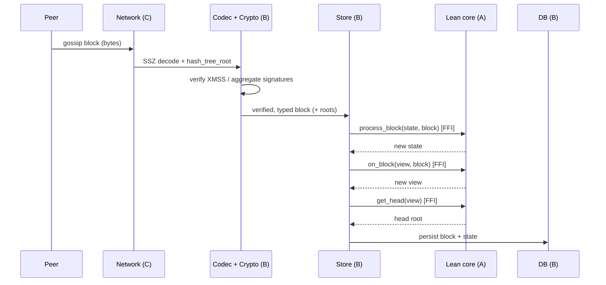
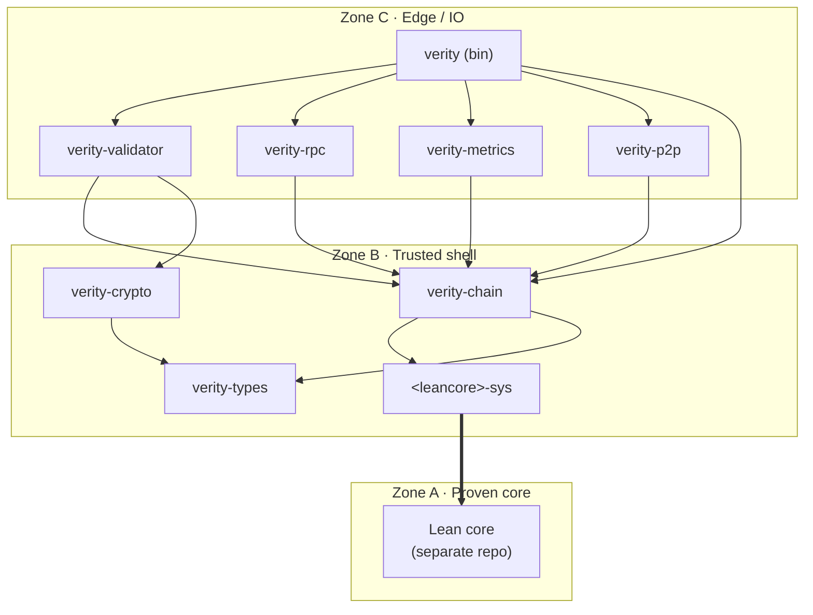

# Verity Architecture

> Status: pre-implementation. This document captures the **architectural intent** derived
> from the [Design Philosophy](docs/src/design-philosophy.md). No Lean or Rust source exists yet.

Verity is a *provable* consensus client: a verified Lean 4 core wrapped in a Rust runtime.
That two-language split makes Verity structurally different from single-language clients, so its
first-class architectural axis is **the verification boundary** — what is inside the proven core
and what is outside it. Everything else, including the concurrency model, follows from that axis.

The architecture is organized into three concentric zones, drawn from the proven core outward.

## Zones

- **Zone A — Proven core (Lean 4, pure).** Pure, total functions only — no hidden state, clocks,
  locks, or scheduling. This is the surface that Lean proofs defend. Compiled via Lean's C backend
  into a static library and exposed to Rust over a C ABI (no Aeneas).
  Deliberately **minimal**: only the state transition and the fork-choice transition functions.

- **Zone B — Trusted shell (Rust, panic-free).** Manufactures clean, typed, **already-verified**
  inputs for the core, owns the consensus state and fork-choice view as a single writer, and threads
  immutable values through the core. Proofs do not reach here, so it is held to the language-level
  bar instead: memory-safe, strongly typed, and panic-free. SSZ / `hash_tree_root` and signature
  verification live here, so the core receives precomputed roots and verified signatures rather than
  recomputing or trusting them itself.

- **Zone C — Edge / IO (Rust, concurrent).** The only place where concurrency and the outside world
  live: networking, the slot clock, validator duties, RPC, metrics, and node orchestration. Bounded
  queues provide backpressure. The choice of concurrency primitive (actor model vs. async tasks) is a
  later, Zone-C-internal decision — it is **not** an architectural concern, because the consensus
  state has a single owner in Zone B and the core is invoked sequentially regardless.

## Component diagram

## Inbound block — crossing the boundary

The boundary crossing over time, for a block arriving from a peer. Decoding, root computation, and
signature verification all complete in Zone B *before* the core is touched, so each FFI call into the
proven core receives only clean, typed, verified values.

## Crate layout

The Rust runtime is a Cargo workspace. Crates map onto the zones, and **dependencies flow strictly
inward, C → B → A** — the one-directional invariant that makes the verification boundary enforced by
the compiler rather than by discipline. Names follow the existing `verity-*` convention
(`verity-crypto`, `verity-metrics`); the sole exception is the FFI bindings crate, which follows its
upstream Lean library name per Rust's `-sys` convention.

**Crates Verity must build itself**

- `verity-types` — consensus container definitions (Block, State, Vote, …) and constants. SSZ
  encoding / `hash_tree_root` is derived from an external SSZ library, not reimplemented.
  Foundational; depended on by every other crate.
- `<leancore>-sys` — raw FFI bindings to the proven Lean core, which is built and proven in a
  separate repository and consumed here as a static library. Confines all `unsafe`. Named after the
  upstream library.
- `verity-chain` — the single writer that owns the consensus state, the fork-choice store, and
  persistence. The only caller of the proven core; wraps `<leancore>-sys` behind a safe API.
- `verity-validator` — validator duties (production only): block and vote production, signing, and
  aggregation.
- `verity` (binary) — the executable validators run: orchestrator, slot clock, wiring, backpressure.

**Thin glue over existing libraries**

- `verity-p2p` — gossip and req/resp over libp2p.
- `verity-crypto` — adapter over leanMultisig (XMSS verify / sign / aggregate).
- `verity-rpc` — HTTP API surface.
- `verity-metrics` — implementation of the leanMetrics contract.

Zone mapping: **A** = the Lean core (separate repo, not a Cargo crate); **B** = `<leancore>-sys`,
`verity-types`, `verity-chain`, `verity-crypto`; **C** = `verity-p2p`, `verity-validator`,
`verity-rpc`, `verity-metrics`, `verity` (binary).

> **Open for discussion.** The granularity and responsibility split of `verity-chain` and
> `verity-validator` are not settled. Examples still in play: whether proposer selection lives in the
> proven core (Zone A) or is computed Rust-side; whether duty scheduling, signing, and aggregation
> should be separate crates rather than folded into `verity-validator`; and whether persistence
> should split out of `verity-chain`.

## Notes

- Function names in the diagrams (`process_block`, `on_block`, `get_head`, …) are indicative and will
  be reconciled with [leanSpec](https://github.com/leanEthereum/leanSpec) (lstar HEAD) when
  implementation begins.
