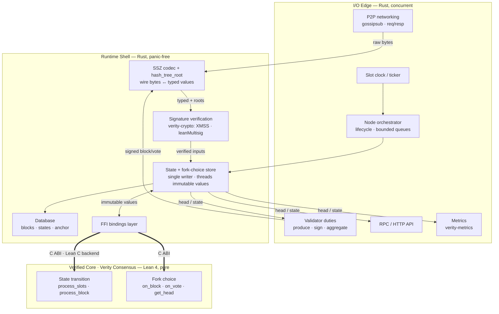
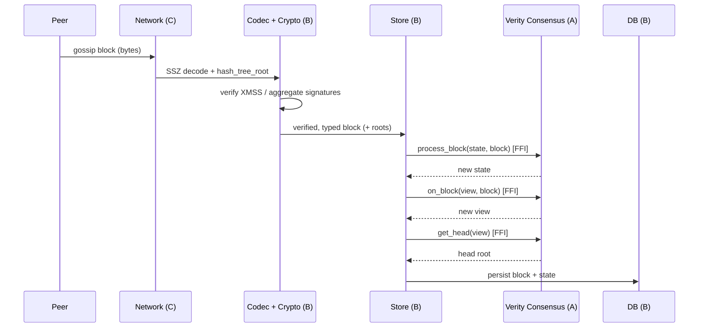
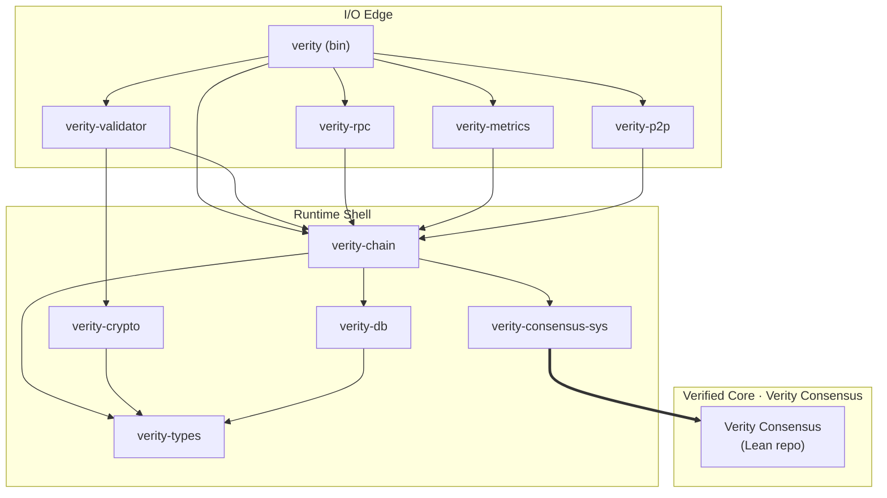

# Verity Architecture

> Status: pre-implementation. This document captures the **architectural intent** derived
> from the [Design Philosophy](docs/src/design-philosophy.md). No Lean or Rust source exists yet.

Verity is a *provable* consensus client: the verified Lean 4 **Verity Consensus** implementation wrapped in a Rust runtime.
That two-language split makes Verity structurally different from single-language clients, so its
first-class architectural axis is **the verification boundary** — what is inside the proven consensus implementation
and what is outside it. Everything else, including the concurrency model, follows from that axis.

The architecture is organized into three concentric zones, drawn from the proven consensus
implementation outward. A zone is defined by the **guarantee level** it holds code to — proven-pure,
trusted-and-panic-free, or concurrent-IO — *not* by the specific components that happen to occupy it
today. Which component sits in which zone is a **current snapshot**, expected to change as the
verification frontier moves; see [boundary migration](#boundary-migration).

## Zones

- **Verified Core — Verity Consensus (Lean 4, pure).** The proven-pure zone: pure, total functions only —
  no hidden state, clocks, locks, or scheduling. This is the surface that Lean proofs defend. Its
  source is the [formal-leanSpec](https://github.com/NyxFoundation/formal-leanSpec) Lean 4 model,
  compiled via Lean's C backend into a static library and exposed to Rust over a C ABI (no Aeneas) —
  see [Formal Verification](docs/src/concepts/formal-verification.md) for the one-model, two-roles
  split between compiled-and-exported functions and proof-only propositions. Its current
  occupants are deliberately **minimal** — only the state transition and the fork-choice transition
  functions — but that export set is a snapshot, not a definition: it contracts if a function leaves for
  a zkVM artifact, and grows if a function (e.g. `hash_tree_root`) is verified in Lean and pulled in.

- **Runtime Shell — Rust, panic-free.** The trusted, panic-free zone. Manufactures clean,
  typed, **already-verified** inputs for Verity Consensus, owns the consensus state and fork-choice view
  as a single writer, and threads immutable values through Verity Consensus. Proofs do not reach here, so
  it is held to the language-level bar instead: memory-safe, strongly typed, and panic-free. *Today*, SSZ
  / `hash_tree_root` and signature verification are realized here as native-Rust implementations of their
  [capability contracts](#capability-contracts), so Verity Consensus receives precomputed roots and
  verified signatures rather than recomputing or trusting them itself. That is a placement, not a
  contract: were a Lean-verified serialization to satisfy the same contract across the FFI seam, Verified Core
  would compute those roots itself and Runtime Shell's consumers would not change.

- **I/O Edge — Rust, concurrent.** The only place where concurrency and the outside world
  live: networking, the slot clock, validator duties, RPC, metrics, and node orchestration. Bounded
  queues provide backpressure. The choice of concurrency primitive (actor model vs. async tasks) is a
  later, I/O-Edge-internal decision — it is **not** an architectural concern, because the consensus
  state has a single owner in Runtime Shell and Verity Consensus is invoked sequentially regardless.

## Component diagram

## Inbound block — crossing the boundary

The boundary crossing over time, for a block arriving from a peer. Decoding, root computation, and
signature verification all complete in Runtime Shell *before* Verity Consensus is touched, so each FFI call into
Verity Consensus receives only clean, typed, verified values.

## Crate layout

The Rust runtime is a Cargo workspace. Crates map onto the zones, and **calls and dependencies flow
inward, from higher-effect / lower-assurance toward lower-effect / higher-assurance — Verified Core never calls
outward.** Today that ordering reads `I/O Edge → Runtime Shell → Verified Core` over the current crate snapshot, and the compiler
enforces it rather than discipline. The invariant is stated over *guarantee levels*, not crate
identities, so it survives migration: if `hash_tree_root` moves into Verified Core, `verity-types` (Runtime Shell)
calls inward to Verified Core for it — still `Runtime Shell → Verified Core`, still legal; if the state transition leaves Verified Core, its export
set shrinks but nothing starts calling outward. Names follow the existing `verity-*` convention
(`verity-crypto`, `verity-metrics`); the sole exception is the FFI bindings crate, which follows its
upstream Lean library name per Rust's `-sys` convention.

**Crates Verity must build itself**

- `verity-types` — consensus container definitions (Block, State, Vote, …) and constants. The
  Serialization capability (SSZ encode / decode, `hash_tree_root`) is *currently* satisfied by an
  external SSZ library behind an adapter in Runtime Shell; the contract (typed value ↔ bytes / root) is stable
  whether that implementation is the external Rust library or a Lean implementation reached over FFI.
  Foundational; depended on by every other crate.
- `verity-consensus-sys` — raw FFI bindings to Verity Consensus, which is built and proven in
  [formal-leanSpec](https://github.com/NyxFoundation/formal-leanSpec) and consumed here as a static
  library: Verity Consensus is the compiled, exported subset of that repository's Lean model — the
  intended mechanism is a dedicated export target (`VerityConsensus`) holding the `@[export]`
  wrappers over the model. Confines all `unsafe`. Named after that export target. It is the
  swappable backend behind the
  [capability contracts](#capability-contracts): its exported function set is exactly *whatever Verified Core
  currently hosts*, and is expected to expand or contract as the frontier moves.
- `verity-chain` — the single writer that owns the consensus state and the fork-choice store, and
  coordinates the `State` and `Store` aggregates under one consistency boundary. The only caller of
  Verity Consensus; wraps `verity-consensus-sys` behind a safe API. Reads and writes through `verity-db`.
- `verity-validator` — validator duties (production only): block and vote production, signing, and
  aggregation.
- `verity` (binary) — the executable validators run: orchestrator, slot clock, wiring, backpressure.

**Thin glue over existing libraries**

- `verity-p2p` — gossip and req/resp over libp2p.
- `verity-crypto` — adapter over leanMultisig (XMSS verify / sign / aggregate).
- `verity-db` — persistence (Repository): blocks, states, and the finalized anchor, over an
  embedded key-value store. Keeps the storage concern out of the single-writer aggregate coordinator.
- `verity-rpc` — HTTP API surface.
- `verity-metrics` — implementation of the leanMetrics contract.

Layer mapping: **Verified Core** = Verity Consensus (the compiled export subset of formal-leanSpec, not a Cargo crate); **Runtime Shell** = `verity-consensus-sys`,
`verity-types`, `verity-chain`, `verity-crypto`, `verity-db`; **I/O Edge** = `verity-p2p`,
`verity-validator`, `verity-rpc`, `verity-metrics`, `verity` (binary).

### Capability contracts

The Verified Core ↔ Runtime Shell boundary is expressed not as a fixed list of FFI functions but as a small set of **capability
contracts** — Rust-side interfaces (traits), one per consensus capability that could be realized on
either side of the proof boundary:

- `StateTransition` — `state_transition(pre_state, verified_block) -> Result<post_state>`
- `ForkChoiceDecision` — the pure decision: `fork_choice_decision(view) -> head / safe_target / updated view`
- `Serialization` / `HashTreeRoot` — `hash_tree_root(value) -> root`, encode / decode
- `SignatureVerification` — verify aggregate (Type-1 / Type-2) proofs

Each contract admits two implementations: a **native-Rust** implementation (the capability lives in
Runtime Shell) or an **FFI-into-Lean** implementation provided by `verity-consensus-sys` (the capability lives
in Verified Core). Consumers such as `verity-chain` depend only on the contract and never learn whether it is
Lean-backed. Which side hosts a capability is therefore the combination of: (a) which implementation is
bound — a wiring decision in the `verity` binary, constrained by what is actually proven; (b) where the
proof obligation sits; and (c) whether that capability's functions appear in the `verity-consensus-sys`
export set.

The contracts' "already-verified inputs" clause has concrete, named content: formal-leanSpec's
theorems are proved relative to explicit well-formedness predicates — `Store.WellFormed` for the
fork-choice store, `AnchorWF` (discharged by `Reachable`) for the state, and
`ValidatorRegistry.WellFormed` for validator keys. Maintaining those predicates across every mutation
is Runtime Shell's half of the contract: Verified Core's theorems speak only about inputs that satisfy
them, so the single writer must preserve them, and the boundary harnesses target exactly them (see the
[Model-Checking Strategy](MODEL_CHECK.md)).

The contracts must be defined **inner to both their consumers and their implementations** — otherwise
`verity-consensus-sys` implementing a contract defined in `verity-chain` would force a `sys → chain`
edge and break the inward invariant. The recommended home is a thin contract crate (e.g.
`verity-consensus-api`) holding only the trait definitions — the minimal expression of a movable
boundary; folding them into `verity-types` is the alternative but mixes container *shape* with
capability *behavior*. The final crate placement is an implementation-time decision; what matters
architecturally is that the boundary is a contract, not a hardcoded call site.

> **Open for discussion.** The granularity and responsibility split of `verity-chain` and
> `verity-validator` are not settled. Examples still in play: whether proposer selection lives in the
> Verity Consensus (Verified Core) or is computed Rust-side; and whether duty scheduling, signing, and
> aggregation should be separate crates rather than folded into `verity-validator`.

## Boundary migration

Because a zone is a guarantee level and placement is a snapshot, components are expected to cross the
Verified Core ↔ Runtime Shell boundary over the life of the project — the [verification boundary moves](docs/src/design-philosophy.md).
The [capability contracts](#capability-contracts) are what make this affordable: a migration is a
**re-binding plus a move of the proof obligation**, not a redesign.

**Cost model — what a migration touches, and what it must not.** A migration may change:

- which implementation is bound behind the capability contract (native-Rust ↔ FFI-into-Lean);
- where the proof obligation sits (a Lean proof vs. a language-level / external-library guarantee);
- the `verity-consensus-sys` export set (it grows or shrinks);
- which crate the implementation lives in.

A migration must **not** change:

- consumer code (`verity-chain`, `verity-validator`) — it depends on the contract, not the placement;
- consensus container **shapes** (the `verity-types` shared model) — shape is separable from the
  serialization *behavior* that may move (see [Domain Model](DOMAIN_MODEL.md));
- the zone **definitions** (the guarantee levels);
- the inward invariant (calls still flow toward higher assurance; Verified Core still never calls outward).

**Anticipated migrations.** Two are foreseen, in opposite directions, alongside two partial placements
already in the design:

| Capability | Today | Anticipated move | Trigger | Effect |
|---|---|---|---|---|
| State transition | Verified Core | Verified Core → Runtime Shell | An upstream spec for SNARK-proving the consensus STF materializes (none published as of 2026-07; see [Ethlambda notes](memo.md#open-question-unresolved-zk-proving-the-stf-vs-lean4-verification)) | Verified Core export set shrinks; FFI surface contracts; the `StateTransition` contract is bound to a zkVM-friendly (Rust / leanVM) implementation |
| SSZ / `hash_tree_root` | Runtime Shell | Runtime Shell → Verified Core | A Lean-verified merkleization becomes available | Verified Core computes its own roots; "Verity Consensus receives precomputed roots" no longer holds; `verity-types` calls inward to Verified Core for the `Serialization` contract |
| Fork choice | Verified Core (decision) + Runtime Shell (`Store`) | — | — | The worked example of a capability split across the boundary: a pure decision in Verified Core over a mutable `Store` owned in Runtime Shell |
| Proposer selection | Undecided (Verified Core or Runtime Shell) | — | — | Open (see the note above): a Verified Core decision function or computed Rust-side |

The STF row is **not a decision to move it** — the working position is that the STF stays in Verity
Consensus (Lean 4). It is recorded so the design is shown to *withstand* the move if the trigger fires;
the full tension is in [Ethlambda notes](memo.md#open-question-unresolved-zk-proving-the-stf-vs-lean4-verification).

## Notes

- What "proven" means — the artifact chain, the proposition catalog, and the trust base — is defined
  in [Formal Verification](docs/src/concepts/formal-verification.md).
- Function names in the diagrams (`process_block`, `on_block`, `get_head`, …) are indicative and will
  be reconciled with [leanSpec](https://github.com/leanEthereum/leanSpec) (lstar HEAD) when
  implementation begins.
