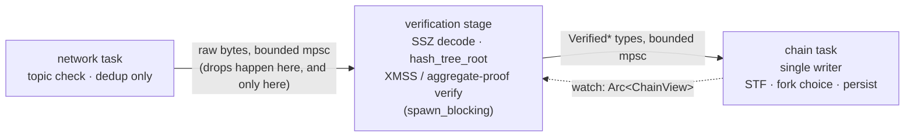

# Verity Concurrency Model

> Status: pre-implementation. Decisions ratified 2026-08-15. This document settles the question
> [ARCHITECTURE.md](ARCHITECTURE.md) left open at the I/O Edge — which concurrency primitive
> enforces the single-writer discipline, where signature and proof verification execute, and how
> inbound work reaches the consensus state — and records the evidence the decisions rest on.

The selection criterion throughout is **verifiability, not throughput**. The deductive proof
stops at the FFI seam and structurally cannot reach concurrency (see
[MODEL_CHECK.md](MODEL_CHECK.md)); the strongest tool available in this zone is exhaustive
concurrency model checking (Loom), and Loom is only tractable on small interleaving spaces. Every
choice below either eliminates a concurrency property outright (by making it a type-system fact)
or confines the surviving interleavings to channel endpoints, where Loom can reach them.

## What the spec constrains, and what it leaves free

Read from [leanSpec](https://github.com/leanEthereum/leanSpec) `main` at
`cce7955660b0d1983d4d104ef2f1cf7a839f4149`.

**Constrained — ordering only:**

- `on_block` calls `verify_signatures(signed_block, parent_state.validators)` *before*
  `state_transition`, and a verification failure aborts the import with no store mutation
  (`src/lean_spec/spec/forks/lstar/fork_choice.py`).
- `on_gossip_attestation` fixes the order: validate the attestation data → verify the XMSS
  signature → record it into the signature pool (aggregators only).
- `on_tick(store, target_interval)` advances time one interval at a time — "runs every
  interval's action without skipping any" (`src/lean_spec/spec/forks/lstar/timeline.py`).

**Free — execution placement:**

- The reference implementation is sequential Python; no thread, task, or pool placement is
  specified for any of the above.
- The reference gossipsub behavior forwards a received message to mesh peers *before* any
  application-level verification runs (`src/lean_spec/node/networking/gossipsub/behavior.py`,
  `_handle_message`). There is no eth2-style validate-before-propagate gate in the protocol, so
  verification sits off the propagation latency path entirely — it has a throughput requirement
  (keep up with slot cadence), not a latency one.

**A structural fact that shapes the design:** verification is not self-contained. Verifying a
block's aggregate proof requires the validator registry from the **parent block's post-state**;
verifying an attestation signature requires the **target block's post-state**. Whatever component
verifies must be able to read consensus state.

## Survey — where other clients run verification

All four public Lean clients were read at the revisions below. None gates gossip propagation on
verification (consistent with the spec reference).

| Client | Revision | Verification placement | Offload |
|---|---|---|---|
| [ethlambda](https://github.com/lambdaclass/ethlambda) | `e16f477` | inline in the store-owning chain actor | none for inbound; `spawn_blocking` only for the aggregator's own proof *production* |
| [ream](https://github.com/ReamLabs/ream) | `842a709` | inline in the lean chain-service task | block proof verification moved to `spawn_blocking`, gated behind the `devnet5` feature |
| [zeam](https://github.com/blockblaz/zeam) | `6495beb` | dedicated chain-worker thread | FFI verifier internally rayon-parallel, thread count configurable; FFI wrapper comments mandate "must not be called from the libxev thread" |
| [qlean-mini](https://github.com/qdrvm/qlean-mini) | `55b6eb3` | inline on the single Boost.Asio io thread that also runs all network I/O | none |

The trend line matters more than any single row: the clients that have started exercising the
production signature scheme are the ones moving verification *off* their event-processing
threads (ream's `devnet5`-gated `spawn_blocking`, zeam's explicit placement rule). The inline
holdouts have not yet been exercised against production-scheme proofs, whose verification cost
is what makes inline placement untenable — a 190 KB aggregate proof verified inline on
qlean-mini's single io thread stalls all network I/O for the duration.

## Decision 1 — the single writer is a task

`verity-chain` runs as **one dedicated tokio task that owns `Store` and `State` outright**. No
locks, no actor framework. Inbound work arrives over bounded channels ([Decision 3](#decision-3--three-inbound-channels-biased-select));
reads leave as immutable snapshots — after each mutation the task publishes an
`Arc<ChainView>` over a `watch` channel, and every consumer (validator duties, RPC, metrics,
the verification stage) reads the snapshot current at its own read time.

Why this form, against the two alternatives:

- **Ownership deletes the property.** With the store owned by one task, single-writer stops
  being a checked property and becomes an aliasing-xor-mutability fact — there is nothing left
  for Loom to explore at the store itself. `Arc<RwLock<Store>>` keeps single-writer as a
  convention, puts every read-modify-write interleaving into the model-checking space, and that
  space exceeds what Loom can exhaust — assurance would degrade to randomized exploration
  (Shuttle, unsound).
- **Sequential FFI by construction.** The Lean theorems are about pure, sequential functions.
  With one owning task, every call into Verity Consensus is serialized structurally, so the
  proofs' premises hold by construction rather than by lock discipline.
- **A total event order exists.** The inbound channels give the chain task a single linear
  sequence of events, which supports the refinement claim this architecture aims at: *the
  node's observable consensus state is the fold of the transition functions over the inbound
  event sequence* — the same shape as the leanSpec/formal-leanSpec model, checked continuously
  by the leanSpec fixture suite. Under a shared-lock design no canonical event order exists,
  and linearizability itself becomes a proof obligation.
- **No framework in the trust base.** An actor framework would add third-party concurrent
  internals (mailboxes, supervision) that Loom cannot instrument, to solve a problem
  `tokio::sync::mpsc`/`watch` already solve.

## Decision 2 — verification is a stage in front of the chain task

- **Placement.** Between the network task and the chain task, as its own stage — the
  `Codec + Crypto` participant in ARCHITECTURE.md's inbound-block sequence, made an execution
  unit. The network task performs topic validation and deduplication only: no decode, no
  crypto, so network liveness (mesh maintenance, keep-alives) never waits on a proof.
- **Execution.** The stage runs decode, `hash_tree_root`, and XMSS / aggregate-proof
  verification on `tokio::task::spawn_blocking`. **No rayon pool, and no promotion path to
  one** — settled 2026-08-15 for design simplicity. (zeam demonstrates the rayon endpoint
  works, but Verity does not carry the option.)
- **The type boundary is the enforcement.** The channel into the chain task carries
  `VerifiedBlock` / `VerifiedAttestation` values whose constructors are private to the
  verification stage. An unverified value cannot reach the chain task, and therefore cannot
  reach the FFI: the spec's verify-before-STF ordering holds by construction, and the boundary
  harnesses (Kani / bolero, per MODEL_CHECK.md) cut exactly at these constructors.
- **State supply.** The stage resolves validator registries (parent / target post-state) from
  the `watch`-published `Arc<ChainView>` snapshot — the read side of Decision 1 is the supply
  line.
- **Pending lives in the stage.** A block whose parent post-state is not yet in view cannot be
  verified; it waits in a bounded buffer inside the stage, keyed by parent root, retried when
  the `ChainView` updates, oldest-evicted on overflow. The chain task never holds unverified
  values — the invariant admits no exceptions.
- **Propagation is not gated.** Matching the spec reference and all four surveyed clients,
  gossipsub is configured without message validation gating (`validate_messages()` is not
  enabled); forwarding proceeds independently of verification.

**Deliberate deviation.** ream and zeam offload verification *inside* the import path; Verity
hoists it into a stage *before* the importer. The motivation is not performance but Decision
1's verification story: the chain task stays a loop of short sequential steps with no re-entry,
which is what keeps its interleaving space Loom-sized and the fold-refinement claim clean.

## Decision 3 — three inbound channels, biased select

The chain task's inbox is three independent channels, not one. The unit of separation is
**what full-queue behavior is correct**, which differs irreconcilably per source:

| Channel | Carries | Primitive | Full-queue behavior |
|---|---|---|---|
| ① clock | "the clock reached interval N" | `watch` (capacity 1, latest wins) | coalesce — never lost, never stale |
| ② local | own proposed `SignedBlock`, own `SignedAttestation`, completed `SignedAggregatedAttestation` from the aggregation worker | small bounded `mpsc` | sender awaits — **never dropped** |
| ③ network | `VerifiedBlock` / `VerifiedAttestation` / verified aggregates, from gossip and range-sync responses | bounded `mpsc` | sender (verification stage) awaits; backpressure propagates to the network edge, where raw gossip is dropped by `try_send` |

The chain task reads all three in a `tokio::select!` with `biased` ordering ① → ② → ③.

- **① is sound as latest-only** because of the spec's own catch-up semantics: `on_tick` steps
  to the target one interval at a time and skips no interval's action, so delivering only the
  newest target loses nothing. The tick is not a timer callback — it drives genuine store
  mutations (ingest pending attestations at intervals 0 and 4, trigger aggregation at 2,
  advance the safe target at 3), which is why it enters the single writer's inbox at all.
- **② is never dropped** because its contents are the node's own duty products: no other peer
  holds them, range sync cannot recover them, and losing one is a missed duty. Its flow rate is
  structurally tiny (a handful of events per slot), so a small buffer with an awaiting sender
  costs nothing. Aggregate-proof *production* — seconds of zk proving — follows the ethlambda
  pattern: the tick triggers it, a `spawn_blocking` worker computes it, and the finished
  aggregate re-enters through ②.
- **③ is the only place load is shed, and only pre-verification.** Backpressure runs backwards
  through the pipeline so that when the node falls behind, what gets dropped is raw bytes at
  the network edge — never a value that verification effort was already spent on. Everything
  dropped there is peer-recoverable by construction: `BlocksByRange` responders MUST serve
  3,600 slots (leanSpec floor) and Verity itself retains proofs for 21,600 slots
  ([STORAGE.md](STORAGE.md)). Range sync is pull-based, so it cannot flood ③ beyond what the
  node itself requested.
- **Biased ordering cannot starve** ① or ② in practice — their rates are bounded by the slot
  clock, not the network — and the bias is the desired property stated directly: time and the
  node's own duties are processed ahead of any volume of gossip.

## Verification obligations introduced by this model

What this document adds to the [MODEL_CHECK.md](MODEL_CHECK.md) map, concretely:

- **Loom targets:** the chain task's select loop, channel endpoints, and snapshot publication
  — the only interleaving spaces this design leaves alive.
- **Refinement check:** chain-task behavior as a fold of the transition functions over the
  inbound event order, exercised end-to-end by the leanSpec fixture suite in CI.
- **Kani / bolero targets:** the `Verified*` constructor boundary in the verification stage —
  no-panic-on-any-input for decode and proof verification, and rejection ⇒ no store effect.
