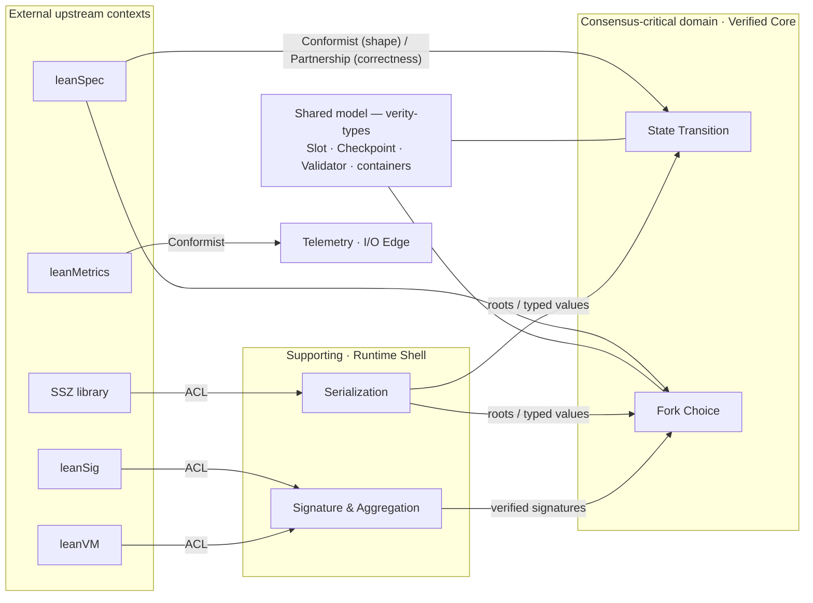
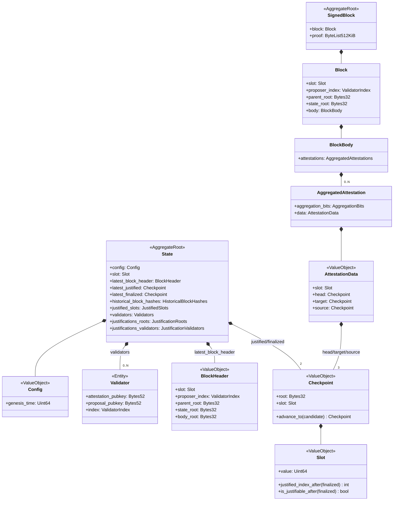
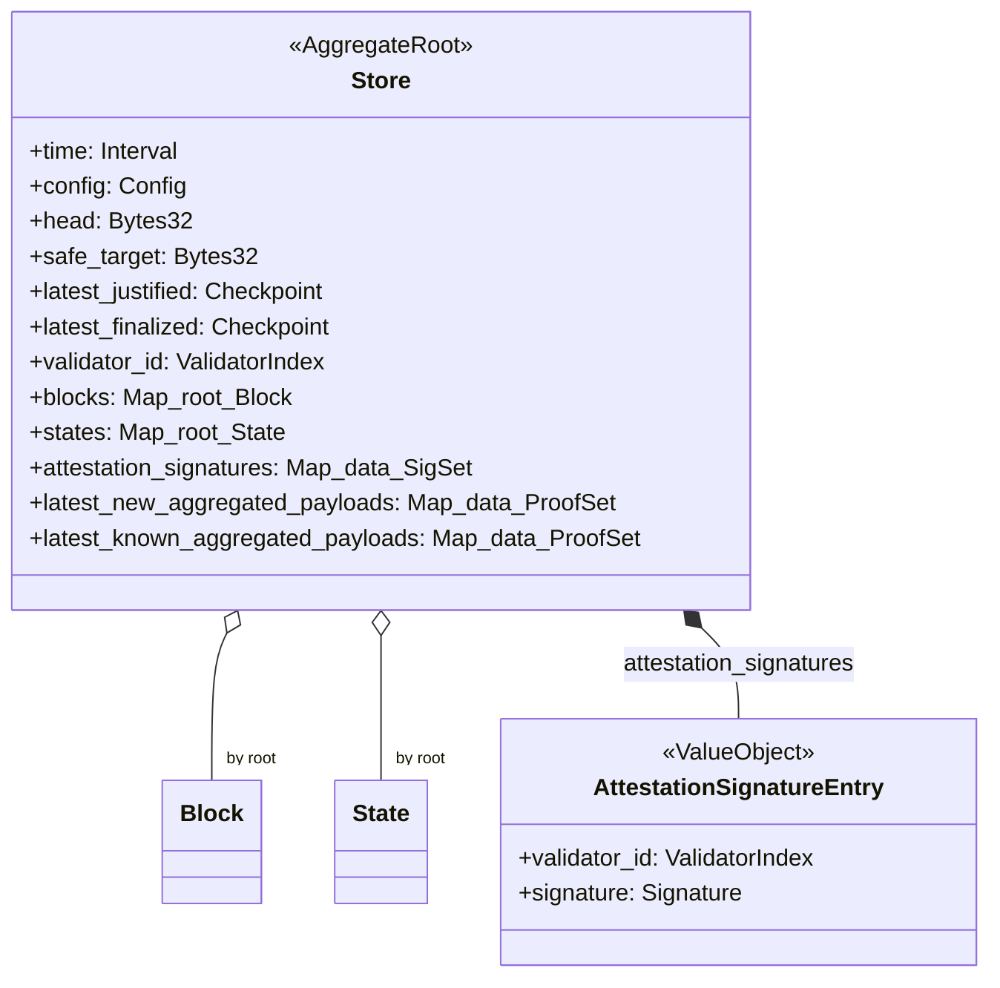
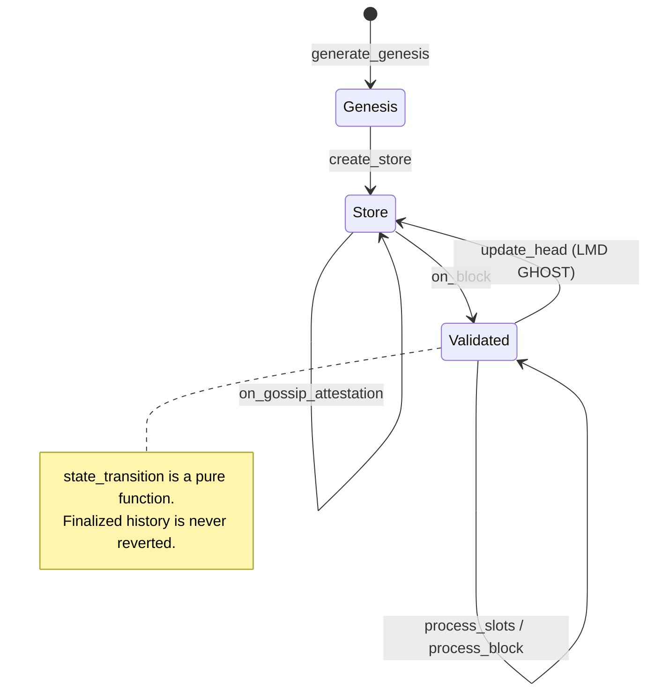

# Verity Domain Model

> Status: pre-implementation. This document models the consensus domain that Verity must
> realize. The single source of truth is **leanSpec** (the Python reference implementation);
> Verity's Rust/Lean types must match it exactly. Read alongside [Architecture](ARCHITECTURE.md).
>
> Grounded in `leanEthereum/leanSpec` `main` @ `57d4339929e4bb8e87a190ea2838408cb9057d82`
> (2026-07-04; `src/lean_spec/spec/forks/lstar/` — the lstar fork, devnet-4/5 in flight).
> The Lean 4 formal model of this ground truth is
> [formal-leanSpec](https://github.com/NyxFoundation/formal-leanSpec); see
> [Formal Verification](docs/src/concepts/formal-verification.md) for how its proposition
> catalog maps onto the zones.

The domain is the **Lean Ethereum consensus protocol**: a set of validators that vote on a
chain of blocks, with two-stage justification/finalization (3SF) deciding what is irreversible.
This model names the entities, value objects, and aggregates of that domain in the language of
the spec, and maps them onto Verity's verification zones.

## Bounded contexts

The consensus domain decomposes into the bounded contexts below. Each owns one model and one
ubiquitous language; the table also records *where* that model is realized. The notable
property — one no single-language client has to reason about — is that **a context's model can
straddle the verification boundary**: **Fork Choice** is proven as pure decision functions in
Verified Core, yet its mutable `Store` and single-writer ownership are realized in Runtime Shell. The
**Realized in** column is a *current snapshot*, not a fixed assignment — capabilities migrate
across the Verified Core ↔ Runtime Shell boundary as the verification frontier moves (see
[boundary migration](ARCHITECTURE.md#boundary-migration)), and the State Transition and Serialization rows are
expected to move in opposite directions. The
*tactical* per-zone view stays in [Mapping to verification zones](#mapping-to-verification-zones)
below; this section is the *strategic* frame above it.

| Context | Kind | Model owns | Realized in | Crate |
|---|---|---|---|---|
| **State Transition** | Consensus-critical | `State` aggregate + `SignedBlock` processing; justification / finalization invariants | Verified Core (pure fns) | Verity Consensus (separate Lean repo) |
| **Fork Choice** | Consensus-critical | `Store` aggregate, LMD GHOST, head / safe_target, payload `new → known` | Verified Core pure decision fns **+** Runtime Shell single-writer store | Verity Consensus + `verity-chain` |
| **Signature & Aggregation** | Supporting | signatures, Type-1 / Type-2 proofs, verify / aggregate | Runtime Shell | `verity-crypto` (ACL → leanSig, leanVM) |
| **Serialization** | Supporting | SSZ encode / decode, `hash_tree_root`, merkleization | Runtime Shell | `verity-types` (+ external SSZ lib) |
| **Validator Duties** | Supporting | proposer / attester duties, production, signing, aggregation scheduling | I/O Edge | `verity-validator` |
| **Networking** | Generic | gossip topics, req / resp, peers | I/O Edge | `verity-p2p` |
| **Persistence** | Generic | block / state store, aggregate-proof store with a bounded retention window, finalized anchor; Repository over RocksDB behind a backend trait ([schema](STORAGE.md)) | Runtime Shell | `verity-db` |
| **Node Orchestration** | Generic | lifecycle, slot clock, backpressure | I/O Edge | `verity` (bin) |
| **API** | Generic | HTTP / RPC surface | I/O Edge | `verity-rpc` |
| **Telemetry** | Generic | metric contract | I/O Edge | `verity-metrics` (Conformist → leanMetrics) |

> **Shared Model.** `Slot`, `Checkpoint`, `Validator`, `Config`, and all SSZ containers form a
> shared model between State Transition and Fork Choice, realized as `verity-types`; changing
> it requires coordination across both consensus-critical contexts. `verity-types` plays a dual role — it
> *is* the shared model (the container value-object definitions) and it hosts the Serialization
> concern (SSZ behavior derived over those types via the external library). These two roles separate
> cleanly: the container **shapes** are the shared model and stay in `verity-types` regardless of zone,
> whereas the Serialization **behavior** (encode / decode / `hash_tree_root`) is a capability whose
> implementation can migrate to Verified Core without touching those shapes — which is why a Lean-verified SSZ
> would not perturb the shared model.

## Context map

Verity does not invent the protocol; it consumes it from upstream contexts. The integration
pattern names *how* each relationship is governed.

| Upstream (external) | Verity context | Pattern |
|---|---|---|
| **leanSpec** | State Transition / Fork Choice | **Conformist** on container shapes; **Partnership** on correctness (proofs find spec bugs; fixes flow back upstream) |
| **leanSig** | Signature & Aggregation | **ACL / Anti-Corruption Layer** (adapter) — per-validator XMSS sign / verify |
| **leanVM** | Signature & Aggregation | **ACL / Anti-Corruption Layer** (adapter) — aggregation and aggregate-proof verification |
| **leanMetrics** | Telemetry | **Conformist** (exact metric contract) |
| **external SSZ library** | Serialization | **ACL / adapter** |

The leanSpec relationship is mediated by
[formal-leanSpec](https://github.com/NyxFoundation/formal-leanSpec): Conformist shape-tracking is
realized as a per-file transcription of the Python spec into Lean 4, and the Partnership on
correctness already operates — proving VAL-2 exposed an unenforced dual-key invariant upstream,
reported and fixed as leanEthereum/leanSpec#1184.

Internally, Serialization and Signature & Aggregation are **suppliers** that hand verified,
typed inputs — roots and already-verified signatures — to the consensus-critical contexts; each
satisfies a capability contract whose implementation may be native-Rust (Runtime Shell) or FFI-into-Lean
(Verified Core). `verity-chain` is the **single-writer customer** that assembles them and is the sole caller of
Verified Core. Persistence is factored out as a **Repository** (`verity-db`) that `verity-chain` reads and
writes through, keeping storage out of the aggregate coordinator. This matches the inward dependency
invariant (calls flow toward higher assurance; Verified Core never calls outward) in
[Architecture](ARCHITECTURE.md).

## Consensus-critical invariants

The model's correctness depends on these rules. They are the domain's "business rules":

| Invariant | Source |
|---|---|
| **Field order is immutable** — it determines `hash_tree_root` | every `Container` |
| **Checkpoints only move forward** — replace only on strictly higher slot | `Checkpoint.advance_to` |
| **Finalized history is never reverted** | fork choice over `latest_finalized` |
| **A slot is *justifiable* iff** distance δ from finalized is ≤5, a perfect square, or a pronic number (x²+x) | `Slot.is_justifiable_after` (3SF-mini) |
| **`JustificationValidators` cap = `HISTORICAL_ROOTS_LIMIT × VALIDATOR_REGISTRY_LIMIT`** — changes merkle depth, hence the state root | `containers/state.py` |

Key constants (`spec/forks/lstar/config.py`): `SECONDS_PER_SLOT=4`, `INTERVALS_PER_SLOT=5`,
`JUSTIFICATION_LOOKBACK_SLOTS=3`, `HISTORICAL_ROOTS_LIMIT=2^18` (≈12.1 days),
`VALIDATOR_REGISTRY_LIMIT=2^12`, `MAX_ATTESTATIONS_DATA=8`, `ATTESTATION_COMMITTEE_COUNT=1`.

## Aggregates at a glance

The domain has three aggregate roots with distinct lifecycles and verification placement:

| Aggregate root | Nature | Realized in |
|---|---|---|
| **`State`** | The consensus state. Hashed (`state_root`); evolved only by the pure state transition. | Verified Core (Verity Consensus) operates on it |
| **`SignedBlock`** | A proposal: a block plus one aggregated proof over all its signatures. | Crosses I/O Edge → Runtime Shell → Verified Core |
| **`Store`** | A node's local fork-choice view. *Not* hashed; mutable working set. | Runtime Shell (single writer) |

The only **Entity** is `Validator` (identity = registry index). Everything else is a **Value
Object** — defined by its attributes and immutable, consistent with the spec's SSZ containers.

## Consensus Containers

### Attestation lineage

The same `AttestationData` flows through several shapes as it is signed and aggregated:

| Type | Composition | Role |
|---|---|---|
| `AttestationData` | slot + head/target/source (Checkpoint) | shared content (VO) |
| `Attestation` | validator_id + data | one validator's vote |
| `SignedAttestation` | + `Signature` (XMSS) | single signed vote before gossip |
| `AggregatedAttestation` | aggregation_bits + data | **stored in a block** (signatures folded into the block proof) |
| `SignedAggregatedAttestation` | data + `TypeOneMultiSignature` | **gossiped** aggregate proof |

## Fork-choice view — `Store`

`Store` is the node's local world view that drives LMD GHOST. It is not consensus-hashed, but
it owns the working set across state transitions.

A payload's `new → known` transition gates fork-choice influence: gossiped aggregates land in
`latest_new_aggregated_payloads` and only contribute to block weights after an interval tick
promotes them into `latest_known_aggregated_payloads` (`accept_new_attestations`).

## Domain services

Cross-aggregate behavior lives in two service families, matching Verity's crate split:

**State transition** (pure; `spec.py`) — evolves the `State` aggregate immutably:
`generate_genesis`, `process_slots`, `process_block_header`, `process_block`,
`process_attestations`, `state_transition`, `build_block`, `verify_signatures`.

**Fork choice** (`store.py` + `spec.py`) — drives the `Store` aggregate:

- inputs: `on_block`, `on_gossip_attestation`, `on_gossip_aggregated_attestation`, `on_tick`
- computation: `compute_block_weights` → `_compute_lmd_ghost_head` → `update_head`, `update_safe_target`
- aggregation: `accept_new_attestations`, `aggregate`
- producer duties: `get_proposal_head`, `get_attestation_target`, `produce_attestation_data`,
  `produce_block_with_signatures`

## Mapping to verification zones

This domain model lines up with the [Architecture](ARCHITECTURE.md) zones:

- **Verified Core (Verity Consensus, Lean):** the `State` aggregate and the state-transition service —
  pure, total functions that the proofs defend.
- **Runtime Shell (trusted shell, Rust):** the `Store` aggregate as single writer; the Serialization and
  Signature & Aggregation capabilities, *today* realized here as native-Rust implementations, so Verity
  Consensus receives precomputed roots and already-verified signatures — a placement, not a contract
  (were SSZ verified in Lean it would compute those roots in Verified Core); and persistence as a Repository
  (`verity-db`) the single writer reads and writes through.
- **I/O Edge (edge / IO, Rust):** delivers `SignedBlock` and `SignedAggregatedAttestation`
  messages and the slot clock that produces interval ticks.

## Ubiquitous language

| Term | Definition |
|---|---|
| **Slot** | Smallest unit of consensus time (4 s). One slot = 5 intervals. |
| **Checkpoint** | A (block root, slot) pair; the unit of justification/finalization. |
| **justified / finalized** | Two-stage confirmation (3SF). Finalized is irreversible. |
| **justifiable** | A candidate slot whose distance from finalized is ≤5, a perfect square, or pronic. |
| **head** | Canonical chain tip from LMD GHOST, computed from `latest_justified`. |
| **safe_target** | A separate "safe to attest" boundary, distinct from head. |
| **Type-1 / Type-2 proof** | XMSS aggregate signatures: Type-1 = single-message aggregate; Type-2 = full-block multi-message proof. |
