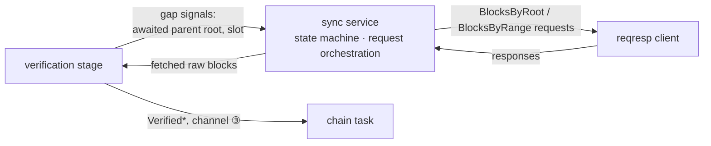

# Sync Pipeline

> Status: pre-implementation. Decisions ratified 2026-08-16. This document settles how Verity
> joins the network and catches up: the sync mode lifecycle, the block-fetch pipeline, and
> peer management. It plugs into the runtime model of [CONCURRENCY.md](CONCURRENCY.md) and
> pays two debts recorded there and in [KEY_MANAGEMENT.md](KEY_MANAGEMENT.md): the mechanism
> by which "the chain notices the missing ancestry", and the peer-scoring policy both
> documents deferred to this design.

## What the spec fixes, and what it leaves free

Read at leanSpec `main` = `cce7955`.

**Fixed — the wire contract** (`src/lean_spec/node/networking/reqresp/`):

- Three protocols, all SSZ + snappy-framed: **Status** (a validator-set-free 80-byte pair of
  checkpoints, `finalized` + `head`), **BlocksByRoot** (a list of roots; missing roots are
  skipped silently — partial responses are legal), and **BlocksByRange** (`start_slot` +
  `count`, no `step` field).
- Limits: `MAX_REQUEST_BLOCKS = 1024` per request, 10 MiB uncompressed payload cap, 10 s
  response timeout. Response codes: `SUCCESS`, `INVALID_REQUEST`, `SERVER_ERROR`,
  `RESOURCE_UNAVAILABLE`.
- The suite's **one MUST**: a responder serves `BlocksByRange` over the sliding
  `MIN_SLOTS_FOR_BLOCK_REQUESTS = 3600`-slot window; below it, `RESOURCE_UNAVAILABLE`.
  Verity's responder side — retention, `served_from_slot`, refusal below the window — is
  already fixed in [STORAGE.md](STORAGE.md#retention-and-range-sync) and is not restated
  here.
- **Checkpoint sync is HTTP, not libp2p**: a Beacon-API-shaped GET of
  `/lean/v0/states/finalized` and `/lean/v0/blocks/finalized` returning raw SSZ. The spec
  defines the endpoints (its reference node serves them); the fetching procedure and its
  validation depth are client-defined.

**Free — everything behavioral.** The sync state machine, batching policy, peer selection,
scoring, punishment, connection limits, and gossip gating during sync are all unspecified;
no conformance fixture touches them (the only sync vectors pin checkpoint-state structural
verification). The reference node under `node/sync/` implements a complete sync design —
a three-state machine, a pending-block cache, backfill, and a request-reliability peer score
— which is **precedent, not obligation**: none of the four public clients follows it.

## Survey — what other clients do

Read at ethlambda `e16f477`, ream `842a709`, zeam `6495beb`, qlean-mini `55b6eb3`.

| | Sync state machine | Deep catch-up | Re-sync trigger once synced | Peer management |
|---|---|---|---|---|
| ethlambda | duty-gating lag heuristic, separate from the sync driver | BlocksByRange, single batch in flight | **none** — Status runs once per connection; a node that falls behind on a stable connection never recovers | none (an unimplemented TODO) |
| ream | Syncing/Synced on finalized-checkpoint gap | **never sends BlocksByRange** — root-chasing BlocksByRoot job queues only | continuous gap-persistence check (300 ms) | app score + slow-peer 30-min ban + non-canonical-checkpoint disconnect |
| zeam | explicit 4-variant status | range when gap > 4 slots; by-root walk capped at 64 slots | interval + wall-lag + gossip-stall + stuck-cluster detectors | capability TTL flag only; transient failures deliberately excluded |
| qlean-mini | none — purely reactive | by-root, one block per round-trip | none — Status once per connection | connect backoff only |

Two structural lessons recur. First, **triggering matters more than mechanics**: ethlambda
and qlean-mini check "am I behind?" only at connection time, so both share a failure mode
where a stably-connected node that falls behind has no trigger left to fire. Second,
**head-lag is the wrong trigger**: zeam's code rejects it explicitly, because when the whole
network halts, every node looks "behind" and gates its own proposals — a liveness deadlock.
The comparison must be against what peers claim is *finalized*, not against the wall clock.

## Decision 1 — sync mode lifecycle

Verity adopts the reference node's three-state machine, with the surveyed refinements:

- **States: `IDLE → SYNCING → SYNCED`**, demotion `SYNCED → SYNCING` when a gap reappears,
  and no `IDLE → SYNCED` shortcut (the reference's transition guards, kept).
- **The SYNCING trigger is `our head slot < network finalized slot`**, where the network
  finalized slot is the **majority vote** over connected peers' Status claims (the reference
  scheme). Not head-lag (zeam's deadlock rationale), and not the maximum peer claim (one
  lying peer could hold the node in SYNCING forever).
- **The condition is evaluated continuously.** Status is re-exchanged periodically rather
  than once per connection, and the trigger is re-checked on every Status update — the
  ethlambda/qlean-mini once-per-connection design is the named counterexample.
- **Duties require `SYNCED`.** The sync service publishes its state over a small `watch`
  channel; the validator duty loop reads it as its **third serving gate**, joining the two
  from [KEY_MANAGEMENT.md](KEY_MANAGEMENT.md) (first `ChainView` observed, keys prepared) —
  an application of CONCURRENCY.md's necessary-not-sufficient rule. A validator that
  attests while behind broadcasts votes for a stale head and burns one-time signatures
  (KEY_MANAGEMENT.md) for nothing.
- **Checkpoint sync is the entry procedure, before the machine starts.** With
  `--checkpoint-sync-url`, fetch the finalized state and block over HTTP and verify at the
  strictest surveyed depth (ethlambda's): genesis-time match, validator-registry match
  against local genesis config, slot-ordering invariants
  (`finalized ≤ justified ≤ state slot`), checkpoint-root consistency, and
  `hash_tree_root(state) == anchor_block.state_root`. On any fetch or verification failure
  the node **fails closed and exits** — no silent fallback to genesis or to a stale
  database. Starting from a different anchor than the operator asked for is an operator
  decision, never an automatic one. (qlean-mini's decode-only validation and dead
  `ValidationFailed` variant are the counterexample.)

## Decision 2 — the fetch pipeline

- **The sync service is its own I/O Edge task** (the reference's `SyncService` placement).
  It owns the state machine of Decision 1, aggregates peer Status, and orchestrates
  requests. It is a peer of the networking and validator tasks in the
  [CONCURRENCY.md](CONCURRENCY.md) lifecycle: spawned by the binary, serving after the
  first `ChainView`.
- **Gap noticing is a signal from the verification stage.** When the stage parks an item
  whose parent (or attestation target) post-state is not in view — and when it evicts one —
  it emits the awaited root and slot to the sync service over a bounded channel. This is
  the concrete mechanism behind CONCURRENCY.md's "range sync closes the gap when the chain
  notices the missing ancestry": the noticing happens where unknown parents are first
  discovered, not in the chain task.
- **Small gaps go by root, large gaps by range** (zeam's split). A gap of at most a few
  slots is fetched as a targeted `BlocksByRoot` for the missing parent, with the ancestor
  walk capped — a by-root walk cannot close a large gap faster than the chain grows (zeam
  caps at 64 slots; the exact thresholds are tunables). Anything larger runs
  `BlocksByRange` forward from the last connected slot: **one batch in flight at a time**,
  up to `MAX_REQUEST_BLOCKS` per batch, paginated until the gap closes (ethlambda's shape;
  zeam's concurrent non-overlapping windows are complexity the devnet scale does not
  justify — revisit on measurement). ream's everything-by-root design is the
  counterexample for deep sync: a one-day gap is ~21,600 sequential round-trips.
- **Fetched blocks take the same path as gossip: through the verification stage into
  channel ③.** There is no side door into the chain task; the `Verified*` type invariant
  of CONCURRENCY.md holds for the sync path without exceptions.
- **Structural response validation happens in the sync service** before handing blocks to
  the stage: slots within the requested window, monotonic order, chunk count within the
  request. Violations are protocol-level failures and feed the peer score (Decision 3);
  they are distinct from signature verification, which stays in the stage.
- **Gossip during SYNCING**: the block topic stays subscribed — gossip blocks are the input
  that reveals the head-side edge of the gap (the reference's `fill_gap_above_head`
  pattern). Attestation and aggregation processing is **paused** while SYNCING: their
  target states cannot be resolved yet, so they would only churn the pending buffer and
  burn aggregate-proof verification CPU on messages that cannot be imported. This is the
  translation of the reference's `accepts_gossip` gate into the staged pipeline.

## Decision 3 — peer management

The spec is silent here (no scoring, no disconnect rules, no connection limits, and no
conformance coverage), so this is deliberately minimal policy over the one implemented
precedent:

- **Request-reliability score, reference scheme**: per-peer score starting at 100, +10 per
  successful request, −20 per failure ("a failing peer loses weight faster than it earns
  it"), clamped to 0–200. Request targets are chosen by **score-weighted random selection
  that never fully excludes a peer** — on a devnet-sized peer set, exclusion is a direct
  liveness cut. At most 2 concurrent requests per peer. The spec's own client raises
  distinct codec errors *"so callers can downscore the peer"* — the scheme fits the spec's
  design intent even though it is not normative.
- **Transient failures and protocol violations are distinguished** (zeam's regression,
  learned): timeouts and disconnects cost score but never set capability conclusions; a
  "peer does not serve BlocksByRange" capability flag is set only on a genuine
  protocol-level rejection, and carries a TTL so the pool is not poisoned permanently.
- **Invalid gossip content is never punished — counted in metrics only.** Under the current
  spec, gossipsub forwards *before* verification, so the peer that delivered an invalid
  message may be an honest relay, not the originator. Punishing relays is only coherent
  once a validate-before-propagate gate exists ecosystem-wide; no client and no spec text
  has one today. **Revisit trigger:** leanSpec adopts eth2-style gossip validation gating.
- **No automatic disconnects or bans.** Deprioritization through the score is the only
  consequence; ream's slow-peer ban is gated behind a >6-peer condition a devnet rarely
  meets, and ban machinery on a 3-node network is pure liveness risk. Connection limits
  (per-peer streams, pending dials) are operational tunables, not architectural values.
  **Revisit trigger:** joining a public network, or peer counts in the tens.

## Deliberately out of scope

- **Light-client protocols** — no counterpart exists in leanSpec.
- **State snap-sync** — unnecessary: checkpoint sync carries the anchor state over HTTP,
  and all later states are reconstructible from [STORAGE.md](STORAGE.md)'s snapshots and
  diffs.
- **DAS-style data-availability sync** — future-fork machinery with no current spec.
- **Exact thresholds** (by-root/by-range split, Status refresh cadence, walk caps, gap
  channel capacity) — configuration constants; the architectural commitments are the
  split's existence, the continuous re-evaluation, and every buffer being bounded.

## Verification obligations introduced by this model

- **The state machine is a pure function over Status inputs** — transitions
  (`IDLE→SYNCING→SYNCED`, demotion, no shortcut) are property-tested directly; the duty
  gate adds a third case to the readiness-join tests from KEY_MANAGEMENT.md.
- **Kani / bolero:** structural response validation (no-panic on arbitrary response bytes,
  out-of-window and non-monotonic chunks always rejected) and checkpoint-state verification
  (every listed check individually falsifiable — qlean-mini's dead error variant is the
  cautionary tale).
- **Loom:** nothing new — the sync service is one task whose shared edges are bounded
  channels, the same interleaving surface CONCURRENCY.md already targets.
