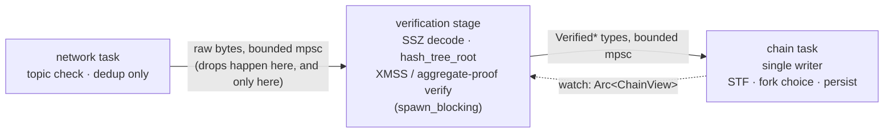

# Verity Concurrency Model

> Status: pre-implementation. Decisions ratified 2026-08-15. This document settles the question
> [architecture.md](../src/reference/architecture.md) left open at the I/O Edge — which concurrency primitive
> enforces the single-writer discipline, where signature and proof verification execute, and how
> inbound work reaches the consensus state — and records the evidence the decisions rest on.

The selection criterion throughout is **verifiability, not throughput**. The deductive proof
stops at the FFI seam and structurally cannot reach concurrency (see
[model-check.md](model-check.md)); the strongest tool available in this zone is exhaustive
concurrency model checking (Loom), and Loom is only tractable on small interleaving spaces. Every
choice below either eliminates a concurrency property outright (by making it a type-system fact)
or confines the surviving interleavings to channel endpoints, where Loom can reach them.

## What the spec constrains, and what it leaves free

Read from [leanSpec](https://github.com/leanEthereum/leanSpec) `main` at
`cce7955660b0d1983d4d104ef2f1cf7a839f4149`.

**Constrained — ordering only:**

- `on_block` calls `verify_signatures(signed_block, parent_state.validators)` *before*
  `state_transition`, and a verification failure aborts the import with no store mutation
  (`src/lean_spec/spec/forks/lstar/fork_choice.py`).
- `on_gossip_attestation` fixes the order: validate the attestation data → verify the XMSS
  signature → record it into the signature pool (aggregators only).
- `on_tick(store, target_interval)` advances time one interval at a time — "runs every
  interval's action without skipping any" (`src/lean_spec/spec/forks/lstar/timeline.py`).

**Free — execution placement:**

- The reference implementation is sequential Python; no thread, task, or pool placement is
  specified for any of the above.
- The reference gossipsub behavior forwards a received message to mesh peers *before* any
  application-level verification runs (`src/lean_spec/node/networking/gossipsub/behavior.py`,
  `_handle_message`). There is no eth2-style validate-before-propagate gate in the protocol, so
  verification sits off the propagation latency path entirely — it has a throughput requirement
  (keep up with slot cadence), not a latency one.

**A structural fact that shapes the design:** verification is not self-contained. Verifying a
block's aggregate proof requires the validator registry from the **parent block's post-state**;
verifying an attestation signature requires the **target block's post-state**. Whatever component
verifies must be able to read consensus state.

## Survey — where other clients run verification

All four public Lean clients were read at the revisions below. None gates gossip propagation on
verification (consistent with the spec reference).

| Client | Revision | Verification placement | Offload |
|---|---|---|---|
| [ethlambda](https://github.com/lambdaclass/ethlambda) | `e16f477` | inline in the store-owning chain actor | none for inbound; `spawn_blocking` only for the aggregator's own proof *production* |
| [ream](https://github.com/ReamLabs/ream) | `842a709` | inline in the lean chain-service task | block proof verification moved to `spawn_blocking`, gated behind the `devnet5` feature |
| [zeam](https://github.com/blockblaz/zeam) | `6495beb` | dedicated chain-worker thread | FFI verifier internally rayon-parallel, thread count configurable; FFI wrapper comments mandate "must not be called from the libxev thread" |
| [qlean-mini](https://github.com/qdrvm/qlean-mini) | `55b6eb3` | inline on the single Boost.Asio io thread that also runs all network I/O | none |

The trend line matters more than any single row: the clients that have started exercising the
production signature scheme are the ones moving verification *off* their event-processing
threads (ream's `devnet5`-gated `spawn_blocking`, zeam's explicit placement rule). The inline
holdouts have not yet been exercised against production-scheme proofs, whose verification cost
is what makes inline placement untenable — a 190 KB aggregate proof verified inline on
qlean-mini's single io thread stalls all network I/O for the duration.

## Decision 1 — the single writer is a task

`verity-chain` runs as **one dedicated tokio task that owns `Store` and `State` outright**. No
locks, no actor framework. Inbound work arrives over bounded channels ([Decision 3](#decision-3--three-inbound-channels-biased-select));
reads leave as immutable snapshots — after each mutation the task publishes an
`Arc<ChainView>` over a `watch` channel, and every consumer (validator duties, RPC, metrics,
the verification stage) reads the snapshot current at its own read time.

`ChainView` is an immutable value — a snapshot, not a live reference — so a reader can never
observe a half-applied mutation and has no way to mutate shared state. What is fixed here is
its **contract**, not its field list: it must carry (a) the current head and the latest
justified / finalized checkpoints, and (b) enough of the block tree and post-states to resolve
a validator registry by block root. Those two clauses serve its two consumer groups — the read
APIs assigned to `verity-chain` (head, finalized checkpoint, state views)
and the verification stage's key resolution. **The `watch`-published snapshot is the entire
read path**: there is no query channel into the chain task; RPC, metrics, and validator duties
answer reads from the snapshot they hold. The exact field layout is an implementation
decision. Three consequences are fixed alongside the contract:

- **Retention bound.** The snapshot covers the *unfinalized* block tree plus the finalized
  anchor — exactly what fork choice operates on, and the only states verification's registry
  resolution can name. Anything older is `verity-db`'s job ([storage.md](storage.md) state
  snapshots + diffs): an RPC query for a historical state is a database read, not a snapshot
  miss.
- **Publication cadence.** At most once per chain-task loop iteration, after an event's import
  has fully completed — never mid-import, so no reader can observe a half-applied mutation.
- **Distribution.** Every consumer receives its `watch::Receiver<Arc<ChainView>>` at
  construction, before its task starts; the same receiver doubles as the startup readiness
  signal ([Lifecycle](#lifecycle)). There is no separate registration or notification
  mechanism.

Why this form, against the two alternatives:

- **Ownership deletes the property.** With the store owned by one task, single-writer stops
  being a checked property and becomes an aliasing-xor-mutability fact — there is nothing left
  for Loom to explore at the store itself. `Arc<RwLock<Store>>` keeps single-writer as a
  convention, puts every read-modify-write interleaving into the model-checking space, and that
  space exceeds what Loom can exhaust — assurance would degrade to randomized exploration
  (Shuttle, unsound).
- **Sequential FFI by construction.** The Lean theorems are about pure, sequential functions.
  With one owning task, every call into Verity Consensus is serialized structurally, so the
  proofs' premises hold by construction rather than by lock discipline.
- **A total event order exists.** The inbound channels give the chain task a single linear
  sequence of events, which supports the refinement claim this architecture aims at: *the
  node's observable consensus state is the fold of the transition functions over the inbound
  event sequence* — the same shape as the leanSpec/formal-leanSpec model, checked continuously
  by the leanSpec fixture suite. Under a shared-lock design no canonical event order exists,
  and linearizability itself becomes a proof obligation.
- **No framework in the trust base.** An actor framework would add third-party concurrent
  internals (mailboxes, supervision) that Loom cannot instrument, to solve a problem
  `tokio::sync::mpsc`/`watch` already solve.

## Decision 2 — verification is a stage in front of the chain task

- **Placement.** Between the network task and the chain task, as its own stage — the
  `Codec + Crypto` participant in architecture.md's inbound-block sequence, made an execution
  unit. The network task performs topic validation and deduplication only: no decode, no
  crypto, so network liveness (mesh maintenance, keep-alives) never waits on a proof. It hands
  raw bytes to the stage with `try_send` on the stage's bounded input channel — the single
  drop point of the entire pipeline.
- **Execution.** The stage runs decode, `hash_tree_root`, and XMSS / aggregate-proof
  verification on `tokio::task::spawn_blocking`. **No rayon pool, and no promotion path to
  one** — settled 2026-08-15 for design simplicity. (zeam demonstrates the rayon endpoint
  works, but Verity does not carry the option.)
- **The type boundary is the enforcement.** The channel into the chain task carries
  `VerifiedBlock` / `VerifiedAttestation` values whose constructors are private to the
  verification stage. An unverified value cannot reach the chain task, and therefore cannot
  reach the FFI: the spec's verify-before-STF ordering holds by construction, and the boundary
  harnesses (Kani / bolero, per model-check.md) cut exactly at these constructors. A
  `Verified*` value wraps the decoded, typed container together with the roots computed during
  verification — architecture.md's "verified, typed block (+ roots)" — so the chain task
  re-computes nothing; the exact fields are an implementation decision.
- **State supply.** The stage resolves validator registries (parent / target post-state) from
  the `watch`-published `Arc<ChainView>` snapshot — the read side of Decision 1 is the supply
  line.
- **Pending lives in the stage.** An item whose required post-state is not yet in view — a
  block's *parent*, an attestation's *target* — cannot be verified; both kinds wait in the
  same bounded buffer inside the stage, keyed by the awaited block root, under the same
  policy. The stage's loop selects over its input channel *and* the snapshot's
  `watch::changed()`; on an update it retries exactly the entries whose awaited root became
  resolvable in the new snapshot. The
  buffer is parked storage, not a send path: it never blocks, and it holds only the one
  *recoverable* failure — parent post-state not yet in view. Every definitive failure —
  malformed SSZ, a root mismatch, an invalid signature or proof — drops the item on the spot,
  counted in metrics (never peer-punished — see
  [sync.md](sync.md#decision-3--peer-management)). Overflow evicts count-bounded, in FIFO
  order of arrival into the
  buffer, and eviction is silent: nothing re-requests an evicted item. An evicted block is
  peer-recoverable — range sync closes the gap when the chain notices the missing ancestry —
  and an evicted attestation's vote re-arrives embedded in an aggregate or a block body. The
  chain task never holds unverified values — the invariant admits no exceptions.
- **Propagation is not gated.** Matching the spec reference and all four surveyed clients,
  gossipsub is configured without message validation gating (`validate_messages()` is not
  enabled); forwarding proceeds independently of verification.

**Deliberate deviation.** ream and zeam offload verification *inside* the import path; Verity
hoists it into a stage *before* the importer. The motivation is not performance but Decision
1's verification story: the chain task stays a loop of short sequential steps with no re-entry,
which is what keeps its interleaving space Loom-sized and the fold-refinement claim clean.

## Decision 3 — three inbound channels, biased select

The chain task's inbox is three independent channels, not one. The unit of separation is
**what full-queue behavior is correct**, which differs irreconcilably per source:

| Channel | Carries | Primitive | Full-queue behavior |
|---|---|---|---|
| ① clock | "the clock reached interval N" | `watch` (capacity 1, latest wins) | coalesce — never lost, never stale |
| ② local | own proposed `SignedBlock`, own `SignedAttestation`, completed `SignedAggregatedAttestation` from the aggregation worker | small bounded `mpsc` | sender awaits — **never dropped** |
| ③ network | `VerifiedBlock` / `VerifiedAttestation` / verified aggregates, from gossip and range-sync responses | bounded `mpsc` | sender (verification stage) awaits; backpressure propagates to the network edge, where raw gossip is dropped by `try_send` |

The chain task reads all three in a `tokio::select!` with `biased` ordering ① → ② → ③. The
loop takes **one event per iteration** and re-enters the `select!`, so the priority order is
re-evaluated after every event and no channel is ever drained in bulk. No fairness window is
needed: every step is short by construction — the heavy work already happened upstream in the
verification stage.

- **① is sound as latest-only** because of the spec's own catch-up semantics: `on_tick` steps
  to the target one interval at a time and skips no interval's action, so delivering only the
  newest target loses nothing. The corresponding **requirement on the chain task**: on reading
  a new target it advances interval-by-interval to that target, executing every intermediate
  interval's action — it must never process only the latest interval. No new bookkeeping is
  required for this: the node's current interval **is** `Store.time`, and the handler is the
  spec's own `on_tick(store, target)` loop — advance while `store.time < target`. The
  authoritative per-interval action map is leanSpec's `tick_interval`
  (`src/lean_spec/spec/forks/lstar/timeline.py`); the actions named here — ingest pending
  attestations at intervals 0 and 4, trigger aggregation at 2, advance the safe target at 3 —
  are that map's content at `cce7955`, cited for orientation. The map is **normative by
  reference to leanSpec `main`**, deliberately not restated here: Verity tracks the moving
  spec (repo policy), so the commit records what was read, not a frozen contract — the chain
  task implements whatever `tick_interval` says at the tracked revision.
  Catch-up cost is not a liveness concern: interval actions are pool ingestion and pointer
  updates, not STF work, so even a long stall replays cheaply. The tick is not a timer
  callback — it drives genuine store mutations, which is why it enters the single writer's
  inbox at all.
- **② is never dropped** because its contents are the node's own duty products: no other peer
  holds them, range sync cannot recover them, and losing one is a missed duty. Its flow rate is
  structurally tiny (a handful of events per slot), so a small buffer with an awaiting sender
  costs nothing. The production side of ② is fixed too: the validator-duty tasks are driven
  by the **same slot clock** that feeds ① — one clock in the `verity` binary, two consumers —
  and never by callbacks from the chain task. At its duty interval a validator task reads the
  current `ChainView` snapshot (proposal head, attestation target), produces and signs, and
  sends the product into ②; the chain task's sole involvement in production is the interval-2
  aggregation handoff below. Aggregate-proof *production* — seconds of zk proving — follows
  the ethlambda pattern with the wiring explicit: the interval-2 tick action in the chain task
  determines that aggregation is due and hands the signature-pool snapshot to
  `verity-validator`'s aggregation worker; the worker runs on `spawn_blocking`, and the chain
  task never awaits it — the finished
  aggregate re-enters through ②.
- **③ is the only place load is shed, and only pre-verification.** Backpressure runs backwards
  through the pipeline so that when the node falls behind, what gets dropped is raw bytes at
  the network edge — never a value that verification effort was already spent on. Everything
  dropped there is peer-recoverable by construction: `BlocksByRange` responders MUST serve
  3,600 slots (leanSpec floor) and Verity itself retains proofs for 21,600 slots
  ([storage.md](storage.md)). Range sync is pull-based, so it cannot flood ③ beyond what the
  node itself requested.
- **Biased ordering cannot starve** ① or ② in practice — their rates are bounded by the slot
  clock, not the network — and the bias is the desired property stated directly: time and the
  node's own duties are processed ahead of any volume of gossip.

## Lifecycle

Startup runs the dependency arrows backwards. The `verity` binary — the owner of all wiring —
opens the database, validates its identity values ([storage.md](storage.md)), and hands the
chain task its handle; the chain task loads the finalized anchor and reconstructs `Store` and
`State` (initial values, `Store.time` included, per leanSpec's store initialization), then
publishes the **first `ChainView`** — that publication is the readiness signal every other
component waits on; only then do the verification stage, network, validator-duty, and RPC
tasks **begin serving**. What the first `ChainView` gates is serving, not construction:
initialization that needs no consensus state — validator key preparation above all
([key-management.md](key-management.md)) — is spawned by the binary at process start and runs
in parallel with this sequence. The first `ChainView` is a *necessary* serving gate for every
component, not always a *sufficient* one: a component may add its own readiness conditions,
and the validator-duty loop does — it serves only once its keys are also prepared
([key-management.md](key-management.md)) and the node is `SYNCED`
([sync.md](sync.md)) — a join of three gates. Shutdown inverts it, and **channel closure is the only
signal** — there is no shutdown broadcast. The binary stops the producers at the edge; each
stopped producer drops its sender; every downstream task exits when its inputs return `None`
(a closed-and-empty channel), with no side-channel bookkeeping. Concretely: the network task
stops and drops its sender; the verification stage, on `None` from its input, stops accepting
work, lets verifications already running on `spawn_blocking` finish and **discards their
results** (blocking work is uncancellable by nature — nothing waits on it), drops its pending
buffer (peer-recoverable, like any network-edge drop), and drops its own
sender, closing ③; the validator tasks stop, closing ②; the chain task consumes ② and ③ to
`None` — duty products are never dropped, in shutdown included — then persists and stops. Process-level
orchestration — signal handling, restart policy — belongs to the `verity` binary and is out of
scope here.

## Deliberately deferred to implementation

Listed so they are not mistaken for omissions:

- **Channel capacities** for ② and ③ and the **pending-buffer size** are configuration
  constants chosen and tuned at implementation time. The architectural commitments are only
  that every buffer is bounded and that each channel's full-queue *policy* is exactly as
  specified above. The sizing anchors are structural, not free: ② carries a handful of events
  per slot (tens suffice); ③ and the pending buffer are sized against per-slot gossip volume
  (order hundreds).
- **Exact field layouts** of `ChainView` and the `Verified*` types — their contracts are fixed
  above, their struct definitions are not — and internal data structures such as the pending
  buffer's index.
- **Peer scoring** in response to invalid (verification-failing) input — settled in
  [sync.md](sync.md#decision-3--peer-management): counted in metrics, never punished, because
  gossipsub forwards before verification and the deliverer may be an honest relay.

## Verification obligations introduced by this model

What this document adds to the [model-check.md](model-check.md) map, concretely:

- **Loom targets:** the chain task's select loop, channel endpoints, and snapshot publication
  — the only interleaving spaces this design leaves alive.
- **Refinement check:** chain-task behavior as a fold of the transition functions over the
  inbound event order, exercised end-to-end by the leanSpec fixture suite in CI.
- **Kani / bolero targets:** the `Verified*` constructor boundary in the verification stage —
  no-panic-on-any-input for decode and proof verification, and rejection ⇒ no store effect.

A panic that escapes despite these checks is not caught and continued: consistent with
architecture.md's error model, it is classed as an availability failure and aborts the
process — never a silently degraded consensus path.
